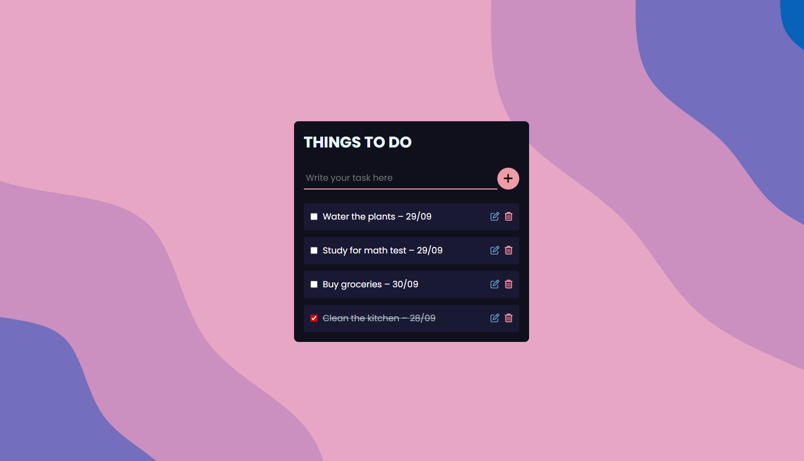

# Todo List 📝✅



## 📌 Table of Contents

- [Todo List 📝✅](#todo-list-)
  - [📌 Table of Contents](#-table-of-contents)
  - [🌐 Overview](#-overview)
  - [⚙️ Features](#️-features)
  - [💻 Technologies Used](#-technologies-used)
  - [🗝️ Key Takeaways](#️-key-takeaways)
  - [🚀 How to Run the Project](#-how-to-run-the-project)
    - [✅ Requirements](#-requirements)
    - [📦 Installation](#-installation)
    - [▶️ Running the Application](#️-running-the-application)
  - [🤝 Contributing](#-contributing)
  - [💬 Contact](#-contact)

## 🌐 Overview

**Todo List** is a web application built using PHP and JavaScript to manage tasks. Users can create, update, delete, and view tasks. The tasks are stored in a MySQL database using PDO for database interactions.

## ⚙️ Features

- ✅ **Create tasks**: Users can add new tasks with a title, description, and due date.
- ✅ **Update tasks**: Users can edit task details such as the title, description, and due date.
- ✅ **Delete tasks**: Users can remove tasks from the list.
- ✅ **View tasks**: Users can see a list of all tasks and their details.
- ✅ **Error handling**: The application handles errors, such as invalid input or database errors.

## 💻 Technologies Used

- **PHP**: The backend programming language for handling server-side logic and database interactions.
- **MySQL**: The database management system for storing and retrieving task data.
- **HTML/CSS**: The frontend technologies for creating the user interface.
- **JavaScript**: The programming language for handling client-side logic and user interactions.
- **PDO**: The PHP Data Objects extension for database interactions.

## 🗝️ Key Takeaways

1. Practiced working with PHP and MySQL to build a web application.
2. Developed CRUD functionality for managing tasks using PDO.
3. Learned to handle form validation and error handling.
4. Gained experience with database interactions and data persistence using PDO.
5. Developed without any frameworks or libraries for stronger foundational knowledge.

## 🚀 How to Run the Project

### ✅ Requirements

Before you begin, make sure you have the following installed:

- PHP >= 7.4
- MySQL or MariaDB
- A web browser (e.g., Chrome, Firefox)

### 📦 Installation

1.  **Clone the repository**:

    ```bash
    git clone https://github.com/Cauebf/php-todo-list.git
    cd php-todo-list
    ```

2.  **Set up the database**:

    - Import the SQL schema (`todo_list.sql`), or create the necessary table manually.
    - Example SQL:

      ```sql
      CREATE DATABASE todo_list;
      USE todo_list;

      CREATE TABLE tasks (
          id int(11) NOT NULL AUTO_INCREMENT PRIMARY KEY,
          description varchar(50) NOT NULL,
          completed tinyint(1) NOT NULL DEFAULT 0
      );
      ```

3.  **Configure the database connection**:

    - Open the `config/conn.php` file.
    - Update the connection details with your MySQL credentials:

      ```php
      $hostname = "your_database_host";
      $username = "your_database_username";
      $password = "your_database_password";
      $dbname = "your_database_name";
      ```

### ▶️ Running the Application

1. **Start the PHP development server**:

   From the project root directory, run:

   ```bash
   php -S localhost:8000
   ```

2. **Access the application in your browser**:

   ```bash
   http://localhost:8000
   ```

   You should now see the Todo List application running.

   > 💡 Tip: For a more robust development experience, consider using a tool like XAMPP or Laragon to manage your PHP and MySQL stack.

## 🤝 Contributing

Contributions are welcome! Feel free to open issues or pull requests for any improvements or bug fixes.

## 💬 Contact

For any inquiries or collaboration opportunities, feel free to reach out via:

[](mailto:cauebrolesef@gmail.com)
[](https://www.linkedin.com/in/cauebrolesef/)
[](https://www.instagram.com/cauebf_/)
[](https://github.com/Cauebf)

<p align="right">(<a href="#todo-list-">back to top</a>)</p>
